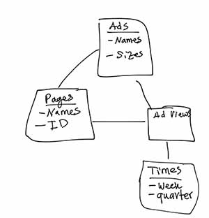
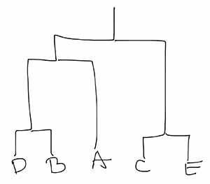

# Midterm corrections

**5**  - ETL stands for Extract, Transform, Load.

**6** - 

**7.2** drill down would be which quarter had highest ad views.

**7.3** ***Slice*** would be to look at ads viewed only on a certain page and ***dice*** would be to only look at ad views for pages containing 'the' in the name.

**7.4** ***Pivot*** would rotate the dimensions - An example would be to view a chart of Ad names vs Page names and the values in the pivot chart could be the aggregate ad views.

**8** 1,5,2,6,7,4,3

**10** Information gain is a way to compare the level of mixedness/purity or homogeneity before and after spliting the data. It is an entropy measurement.

**14**

**15** 

Map/Reduce | step_name | type of key| type of value|
------------ | ------------- | ------------
map | extract_info  | None, record| category, [ave#stars, #reviews]
reduce | compile_ave  | [ave#stars, # #reviews] | category, sum(ave#stars * reviews)/sum(reviews))

Steps: ``(mapper = extract_info, reducer=compile_ave)``

**16** Intersection/Union= ``len([the,midterm])/(len(set1+set2)-len([the,midterm]))``=2/7

